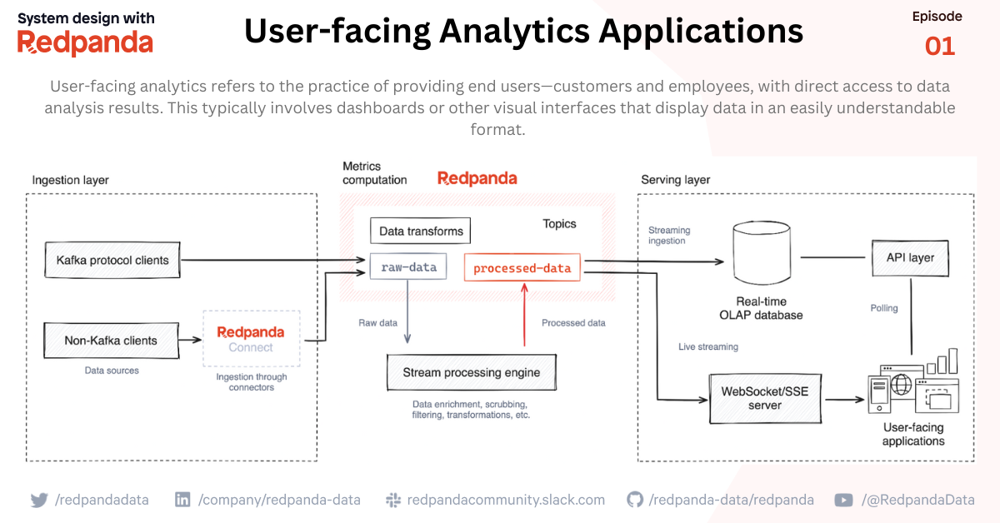

# User-facing Analytics Applications

The goal of user-facing analytics is to empower users to make informed decisions based on data, without needing to rely on data analysts or other specialists.

🎯 Three critical factors for user-facing analytics applications

- Data freshness refers to the ability to ingest and process data in real-time, ensuring that users have access to the most current insights.

- Ultra-low query latency is key to a responsive user experience, allowing complex queries to be processed quickly, even when dealing with large volumes of data.

- High query throughput, facilitated by a system's capacity to handle a large number of simultaneous queries, is crucial in user-facing analytics because it ensures the system can support a large user base without slowing down or crashing. 

1️⃣ Layer one - data extraction: 
The components in this layer collect data from various sources and deliver it to the analytics datastore to run queries later.
This layer features Redpanda as the streaming data platform, supporting high-throughput low-latency data ingestion. Data sources produce data for Redpanda via the Kafka API. Clients that do not natively support the Kafka API could use Redpanda Connect to move data from different systems to Redpanda, even those that do not comply with the Kafka protocol.

2️⃣ Layer two - data processing and metrics computation
Once the data arrives in Redpanda, it might not be ready for immediate analysis. Further data cleansing and transformations are required before sending it to the analytics data store. Stream processing engines like Apache Flink can fit in here nicely.

The final stage of the data pipeline is the serving database. This is where we store the transformed data ready to be served to users.

From a technology perspective, we leverage a real-time OLAP database, like Apache Druid, Apache Pinot, or ClickHouse because they go above and beyond to meet the user-facing analytics requirements we mentioned above.

3️⃣ Layer three - Metrics serving

This is where the metrics stored in the analytical database are served to its audience, primarily the users of the application.

The analytics database is exposed through an API layer, serving metrics and aggregated data to application UIs. Alternatively, we can bypass the serving layer and directly serve from the processed insights topic in Redpanda over WebSockets or Server-sent Events (SSE) for streaming clients.