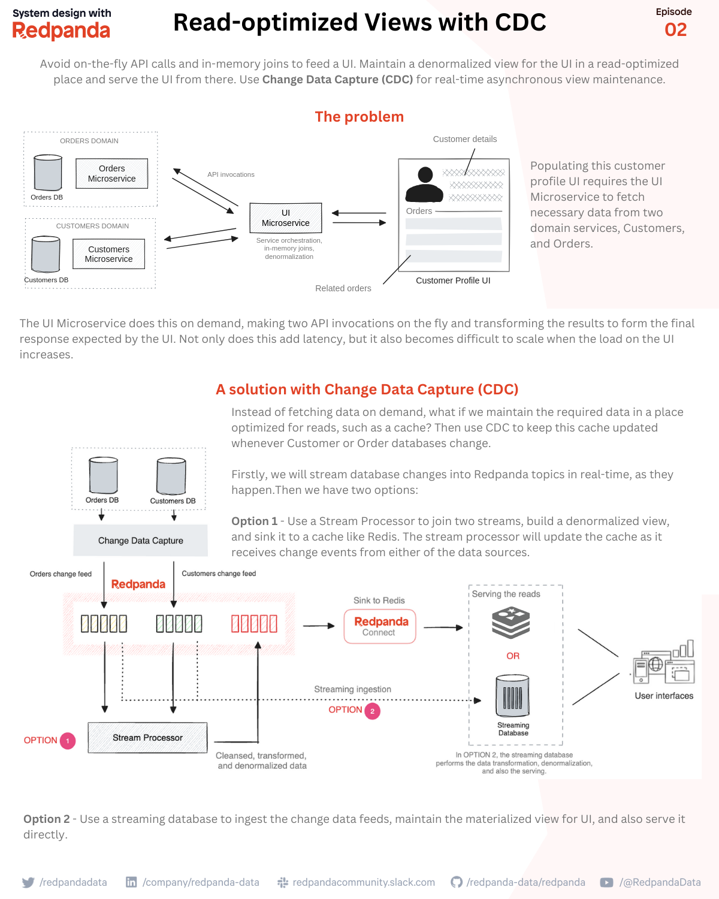

# Read-optimized Views with CDC

How to build read-optimized denormalized views to feed the UIs that are read-heavy and latency-sensitive?

Special thanks to Gunnar Morling for providing feedback on this post 🙏 

🎯 The problem

Consider a customer profile UI you would see on an online store. This UI could display essential customer information along with recent orders.
Populating this customer profile UI requires the UI Microfrontend to fetch necessary data from two domain services, Customers, and Orders, and join by the customerId.

The UI Microfrontend does this on demand, every time the UI is loaded. It will invoke Customer and Order services on the fly, wait for both services to respond, transform the data as necessary, and respond to the UI with the data it expects.

The problem with this approach is the added latency due to network calls and joins. Not to mention the complexity of error handling. Moreover, this becomes difficult to scale when the load on the UI increases.

✅ A solution with Change Data Capture (CDC)

Instead of fetching and joining data on demand, what if we maintain a denormalized view in a read-optimized location, such as in a cache, keyed by the customer ID?

That way we could avoid costly joins and transformations to reduce the read latency.

But how do we keep this denormalized view fresh and up to date with upstream data sources? We will use CDC to keep this cache updated whenever Customer or Order databases change.
Here’s how we’d do that.

Firstly, we need to configure customers and order databases with a CDC system, such as Debezium. That way, the CDC system can detect the database changes in real-time and stream them into two Redpanda topics as change events.

Once the change event streams landed in Redpanda, we have two options:

1️⃣ Option 1 - Use a Stream Processor, like Apache Flink, to join two change 
streams and build a denormalized view. The stream processor will update the cache as it receives change events from either of the upstream sources. This view can be sinked to a cache or key-value store, like Redis, via Redpanda Connect’s sink connector. For example, the value can be the denormalized view formatted as JSON (customer information + orders) while the customerID serves as the key. If there’s an upstream change, the value could be updated with the latest.

2️⃣ Option 2 - Use a streaming database to ingest the change data feeds, maintain the materialized view for UI, and also serve it directly. Streaming databases are good at building and maintaining denormalized views as incrementally updated materialized views. The benefit here is that most streaming databases are also optimized for reads. So you can serve the view directly to the UI service, without using an additional component.

Both options avoid costly ad-hoc API calls, in-memory joins, and the burden of error handling from Microservices. The read latency on the UI will be reduced significantly as it reads from a denormalized view, where, the join has already been done.